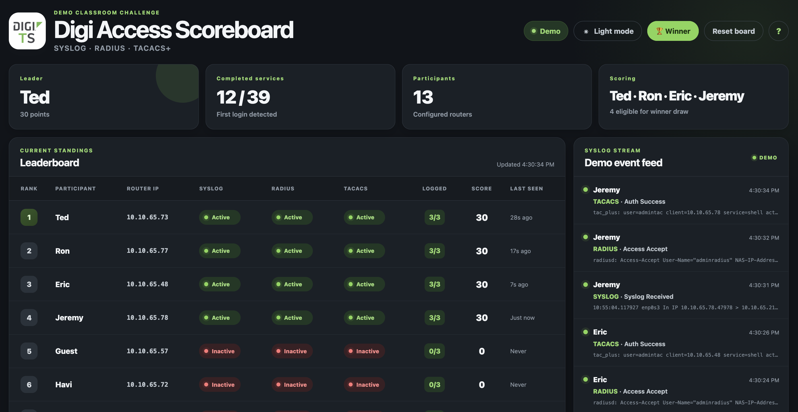
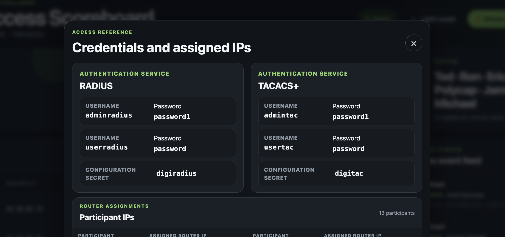

# Digi Access Scoreboard

Digi Access Scoreboard is a small FastAPI web app built for classroom and lab demos. It tracks SYSLOG, RADIUS, and TACACS+ activity, maps router IPs to participants, and updates a live leaderboard in the browser.

The app is designed to make network access challenges easy to follow during a live session. It shows who has completed each service, how many points they have earned, and which participants are eligible for the winner draw.

## Screenshots

### Main dashboard



### Credentials and assigned IPs



## What it does

- Tracks participant progress across SYSLOG, RADIUS, and TACACS+
- Matches events to participants using router IPs, subnets, or Digi hostnames
- Awards points when services are completed
- Shows a live leaderboard and event feed
- Includes a winner selection mode for challenge wrap-up

## Requirements

- Python 3.10 or newer
- `fastapi`
- `uvicorn`

Install dependencies:

```bash
python3 -m venv .venv
source .venv/bin/activate
pip install -r requirements.txt
```

## Configuration

### Participants

Edit `users.json` to define the participants and their router assignments:

```json
{
  "participants": [
    {
      "name": "Javi",
      "router_ip": "10.10.65.72"
    }
  ]
}
```

`router_ip` can be a single IP or a CIDR subnet. You can also add `subnets` to accept events from additional networks while keeping a primary router IP.

### Scoring

Edit `scoring.json` to control how points are awarded:

```json
{
  "points_per_service_first_login": 10,
  "one_time_points": 10,
  "one_time_services": ["syslog"],
  "services": ["syslog", "radius", "tacacs"]
}
```

## Running the app

### Demo mode

Demo mode is the default. It replays `sample_logs.txt`, waits a random 1 to 3 seconds between lines, and loops continuously.

```bash
python app.py
```

Open <http://localhost:8000> in your browser.

To replay the file once:

```bash
DEMO_LOOP=false python app.py
```

To use a different sample file:

```bash
LOG_MODE=demo LOG_FILE=/path/to/sample.log python app.py
```

### Live mode

Live mode watches real log files instead of the demo sample:

```bash
LOG_MODE=live python app.py
```

By default, the app can follow files for SYSLOG, stored Digi messages, and TACACS+/RADIUS accounting. You can also point it to a custom comma-separated list of log files with `LIVE_LOG_FILES`.

## Notes

- The scoreboard is intended for classroom competitions, workshops, and guided lab exercises.
- The winner button is meant for a final raffle-style selection among qualified participants.
- If you change `users.json` or `scoring.json`, restart the application.
