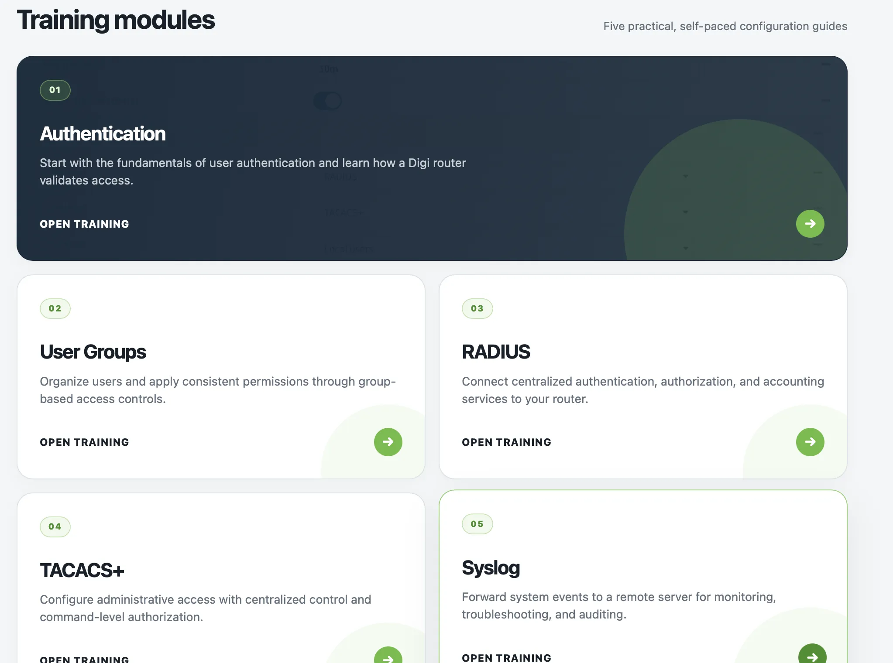

# Digi Router Configuration Training

This project is a static set of HTML pages for Digi router configuration training. It covers the core modules needed to configure authentication, user groups, RADIUS, TACACS+, and syslog.

## Overview

The landing page presents five self-paced training modules:

1. Authentication
2. User Groups
3. RADIUS
4. TACACS+
5. Syslog

Each module is provided as a standalone HTML page with supporting images and a shared visual style.

## Files

- `index.html` - main landing page for the training modules
- `Authentication.html` - authentication module
- `Groups.html` - user groups module
- `radius.html` - RADIUS module
- `TACACS.html` - TACACS+ module
- `Syslog.html` - syslog module
- `img/` - supporting module images
- `dashboard.webp` - dashboard preview image used in this README

## Usage

Open `index.html` in a browser to browse the training modules locally.

## Notes

- The project is self-contained and does not require a build step.
- All pages are static HTML files with local assets.
